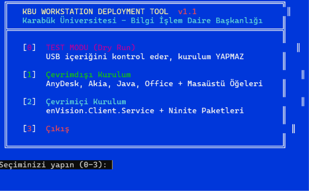
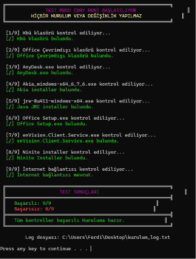

# KBU Workstation Deployment Tool

Windows Batch-based deployment automation tool developed during my internship at Karabük University IT Department.

## Features

- **Offline Installation Workflow** — AnyDesk, Akia, Java JRE, Microsoft Office deployment without internet
- **Online Installation Workflow** — enVision.Client.Service + Ninite package manager with internet connectivity check
- **Dry Run / Test Mode** — Validates all files, folders and internet connection without installing or modifying anything
- **Internet Connectivity Check** — Multi-target ping verification (Google DNS, google.com, Cloudflare)
- **Desktop Shortcut Configuration** — Registry-based toggling of This PC, Control Panel, Network, Recycle Bin icons
- **Silent Java Installation** — Multiple fallback strategies for unattended JRE deployment
- **AnyDesk Deployment** — Copies AnyDesk directly to user's Desktop
- **Installation Logging** — Step-by-step log written to Desktop (`kurulum_log.txt`)
- **Comprehensive Error Handling** — File existence checks before every operation, graceful fallbacks
- **Colored Console Output** — Green/red/yellow status messages for readability
- **Turkish Language Support** — Full UTF-8 support via `chcp 65001`

## Requirements

- Windows 10 (64-bit)
- Administrator privileges
- USB flash drive with the following structure:

```
USB_ROOT
├── kurulum.bat
├── Kbü
│   ├── AnyDesk.exe
│   ├── Akia_windows-x64_6_7_6.exe
│   ├── jre-8u411-windows-x64.exe
│   ├── enVision.Client.Service.exe
│   └── Ninite Chrome Firefox Foxit Reader GOM Installer.exe
└── Office Çevrimdışı
    └── Setup.exe
```

## Usage

1. Plug the USB drive into a fresh Windows 10 computer
2. Right-click `kurulum.bat` → **Run as Administrator**
3. Choose **[0]** Test Mode first to verify USB contents
4. Select **[1]** Offline or **[2]** Online installation based on your needs
5. Wait for completion — a log file will be saved to Desktop

## Screenshots

### Main Menu



### Test Mode



## Notes

- Test Mode performs **zero installations and zero system modifications** — it only checks file/folder existence
- Offline installation refreshes Windows Explorer after adding desktop icons
- Online installation requires an active internet connection — if unavailable, the script will prompt you to use offline mode instead
- All operations are logged to `%USERPROFILE%\Desktop\kurulum_log.txt`

## License

MIT License — see [LICENSE](LICENSE) for details.
